<h1 align="center">Hungry Hound</h1>

A food ordering application.

##### Customer Side
- See restaurant's menu
- Order food 
- Get notify when order accepted/rejected

##### Restaurant Side
- Make menu
- Get notify when a order is made
- Accept/Reject Order

## Application Screen shorts

  
<h4>First Load up Screens</h4>

  &#160; &#160; &#160; &#160;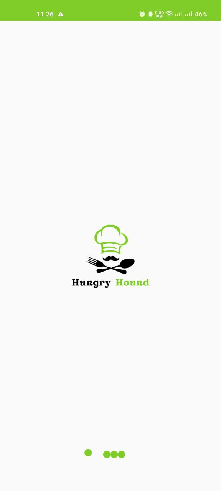  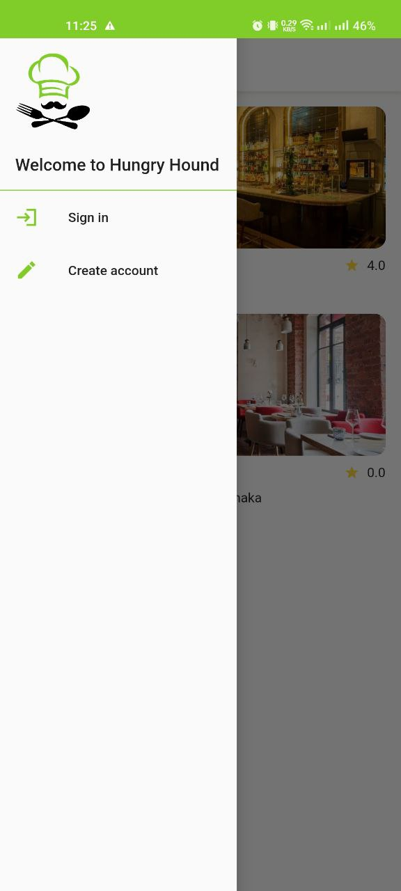

  
<h4>Auth Screen</h4>

  &#160; &#160; &#160; &#160;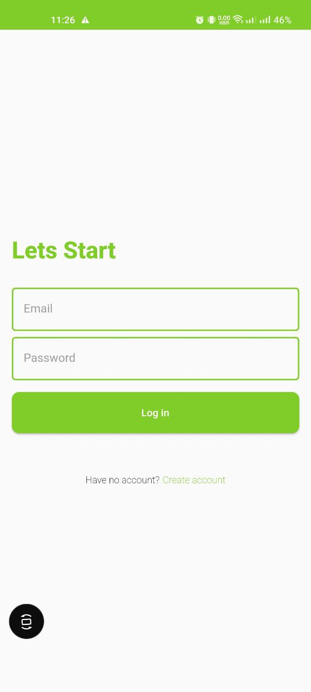 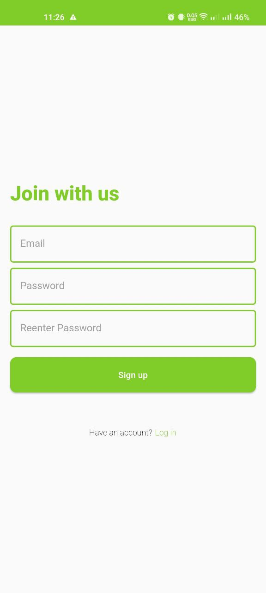 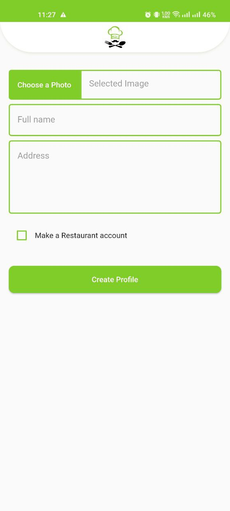
  

  
<h4>Customer Side</h4>

  * ##### Home
      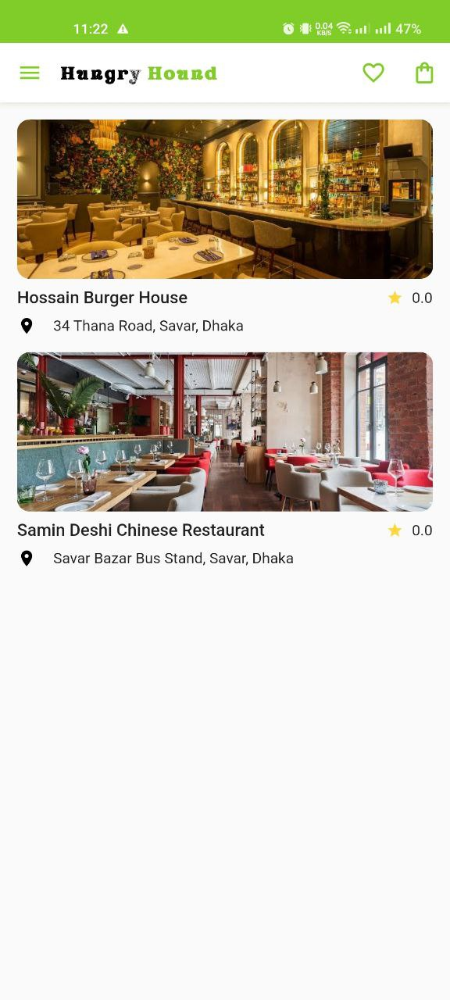 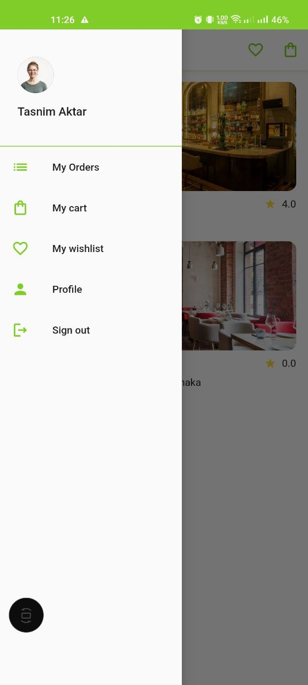
  * ##### Orders
      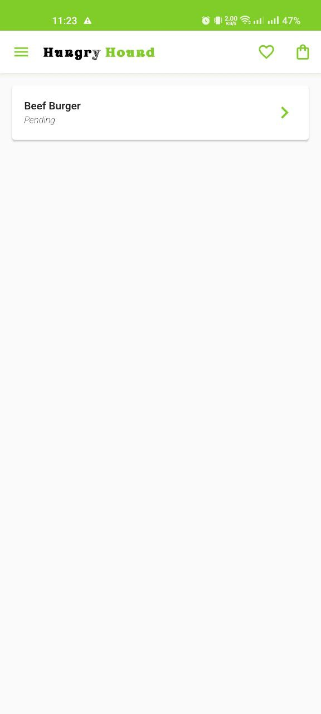
  * ##### Wishlist
      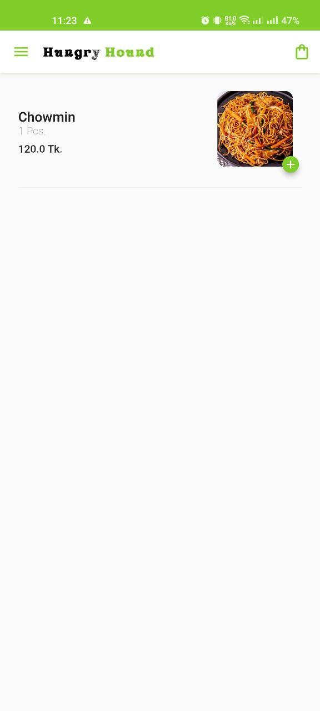
  * ##### Cart
      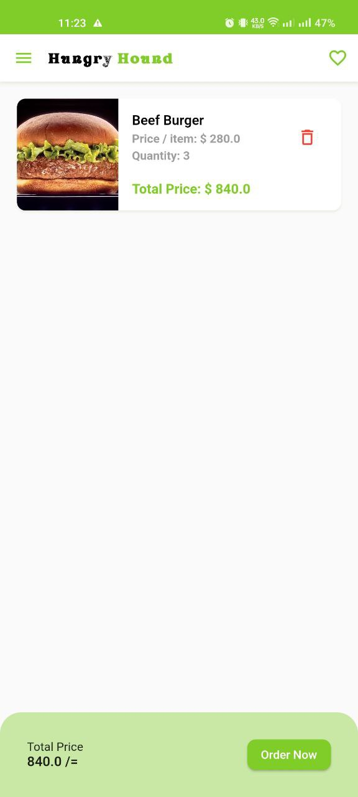
  * ##### Restaurant View
      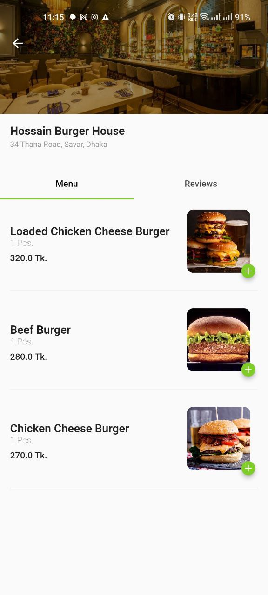 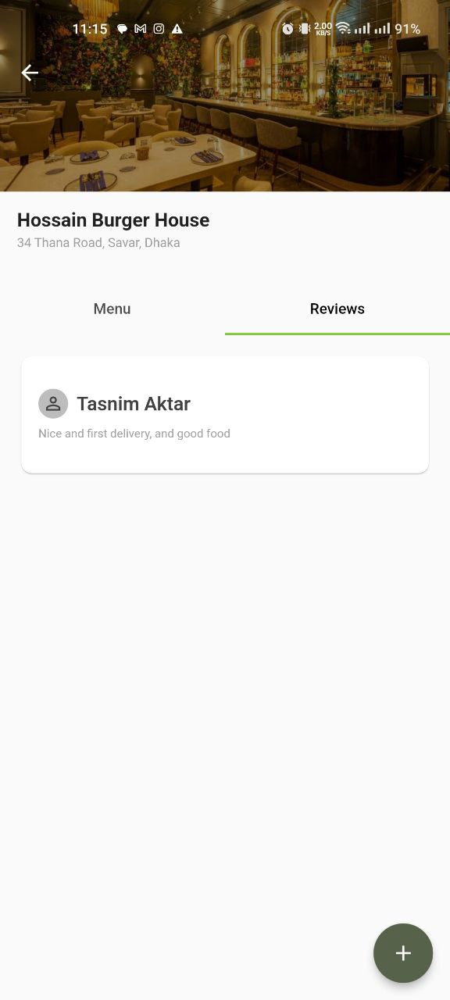 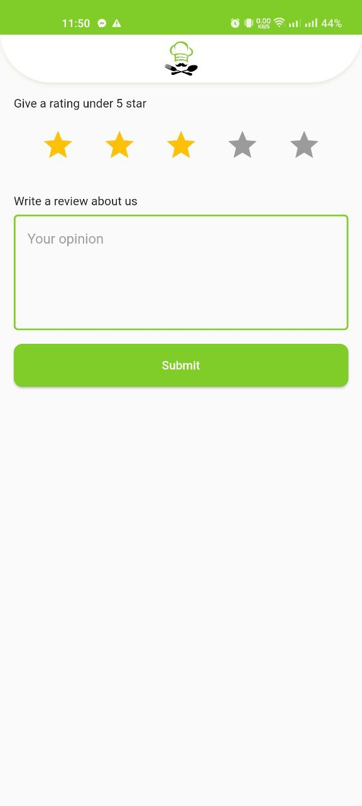
  

  
<h4>Merchant Side</h4>

  * ##### Home
      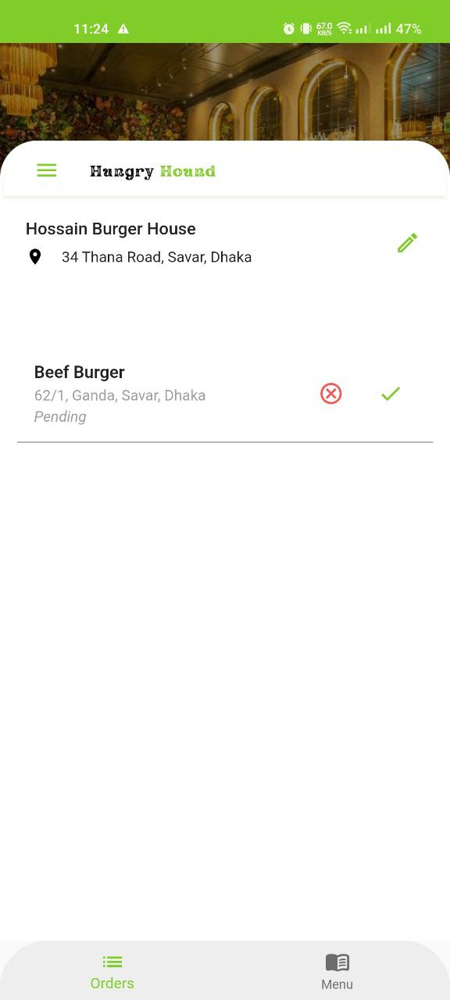 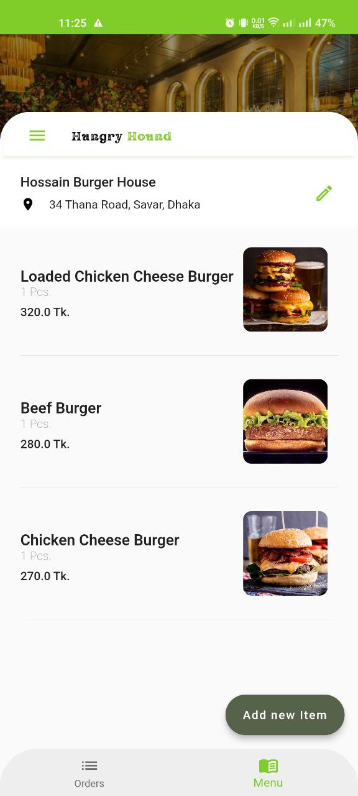 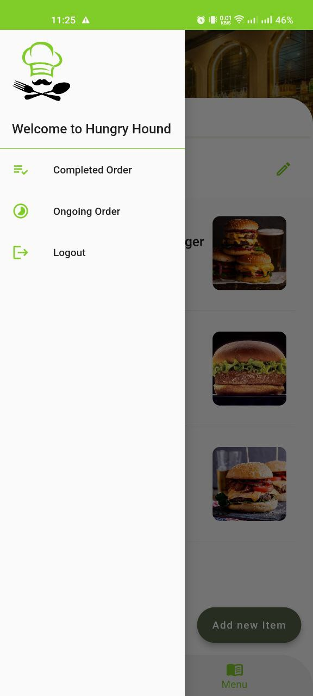
  * ##### Ongoing Order Screen
      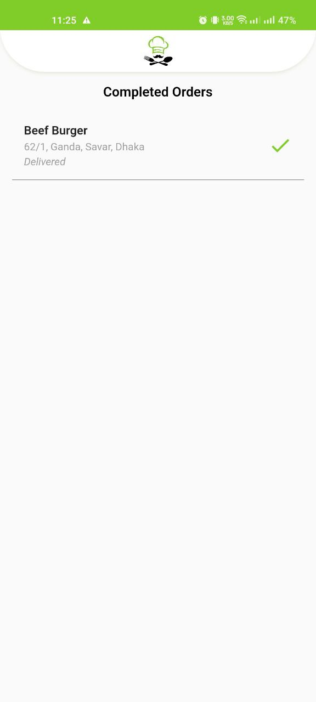
  * ##### Completed Order Screen
      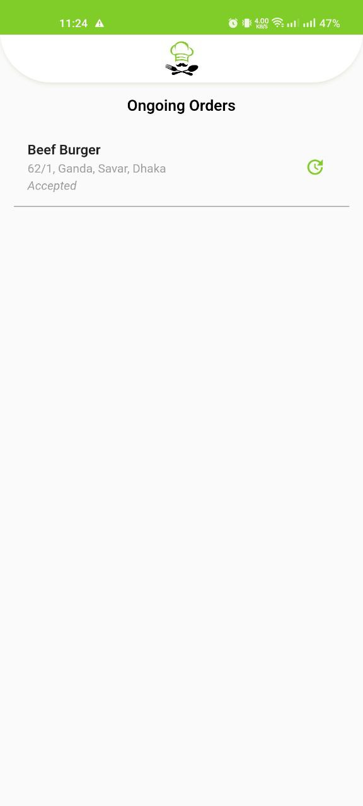
  * ##### Create New Product
      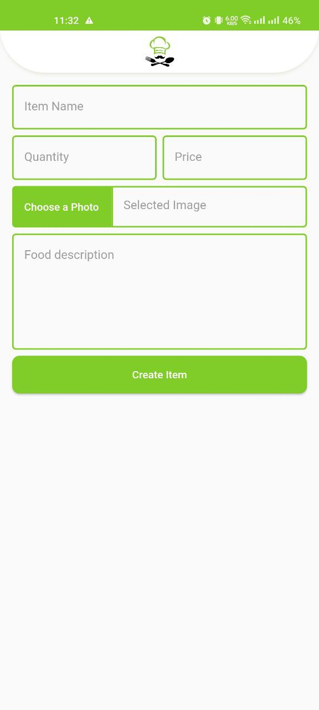

  
## Apk download link

- [Download from google drive](https://drive.google.com/drive/folders/1FR2yWiNrOAJ39OZ2nEbsybpXssL_2Shx?usp=drive_link)

